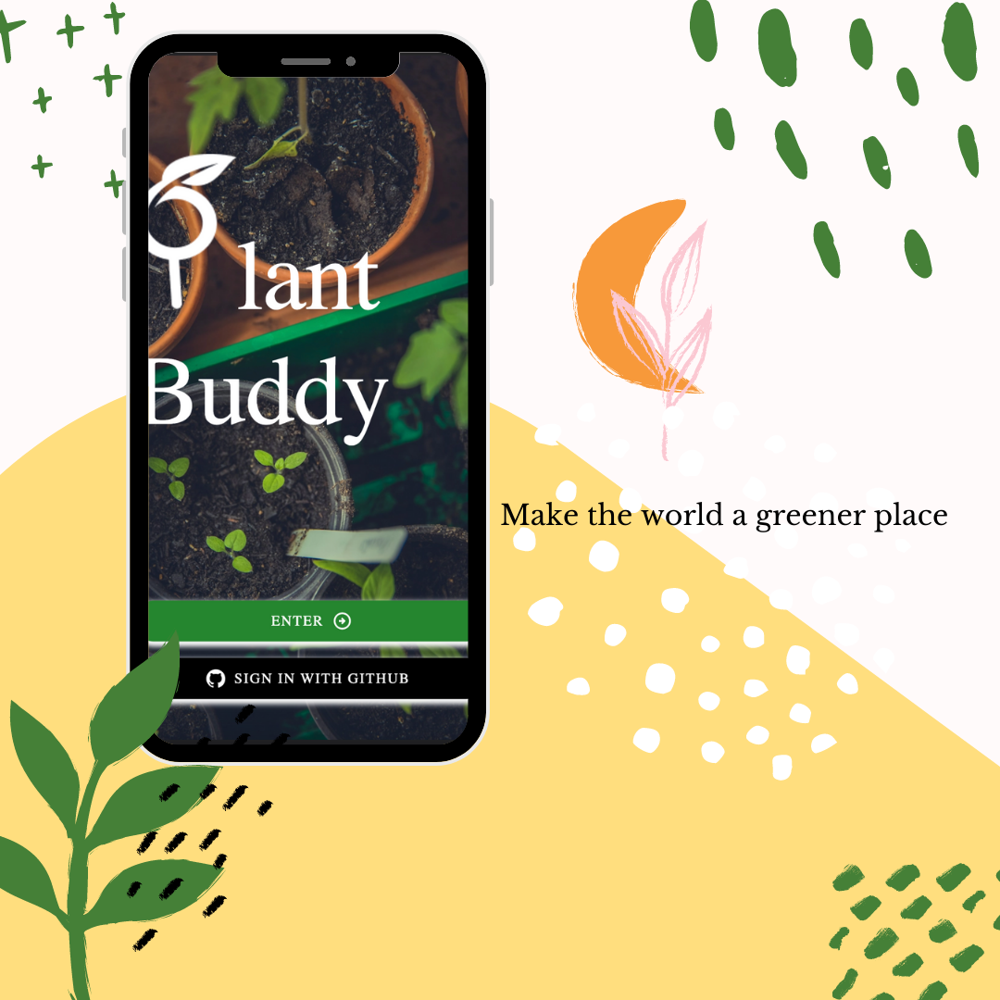

# 🌿 Plant Buddy – Capstone project 🌿

https://user-images.githubusercontent.com/94977620/156158314-51494fe0-2e74-4c93-a88c-f967137bc3c8.mp4

## `Description`

**This is a capstone project for [neuefische](https://www.neuefische.de/) web development bootcamp.**

My capstone project “Plant Buddy” was created to help you locate and share horizontal, as well as vertical green space with other plant enthusiasts in your area. Additionally, it offers you a seed exchange, a plant log and a DIY section to live the full green experience and fulfill your plant needs.

### `Demo`

You can find the hosted version on Vercel: [Plant Buddy Demo](https://nf-capstone-black.vercel.app)

**_IMPORTANT NOTE: currently optimized for mobile!_**

## `Tech Stack`

- React
- Cloudinary
- MUI
- Styled-Components
- Zustand
- MongoDB
- Axios
- localStorage
- React Hook Form
- Next.js
- Next-Auth.js
